# 🛡️ Automated MLOps Drift Detection Pipeline


## 📖 Project Overview
In production machine learning, models degrade over time as real-world data changes—a phenomenon known as **Data Drift**. 

This project is a **serverless MLOps pipeline** designed to automatically monitor model health. It runs a daily simulation to compare "reference" training data against "current" production data. If statistical drift is detected, it triggers a multi-channel alert system and publishes a detailed visual report.

**Live Dashboard:** [🔗 Click here to view the Health Report](https://tasuke-pochira.github.io/drift-monitor/)

---

## 🏗️ System Architecture

The system follows a **GitOps** pattern, using GitHub Actions as the orchestrator to keep costs at zero while maintaining enterprise-grade reliability.

```mermaid
graph LR
    A[📅 Daily Cron Schedule] -->|Triggers| B(GitHub Actions Runner)
    B -->|1. Simulates Data| C{detect_drift.py}
    C -->|2. Runs Statistical Tests| D[Evidently AI Engine]
    D -->|3. Generates Report| E[HTML Artifact]
    
    D -- Drift Detected? --> F{Logic Gate}
    F -- YES --> G[🚨 Send Discord Alert]
    F -- NO --> H[Log Healthy Status]
    
    E -->|Deploy| I[GitHub Pages Dashboard]
```



### Key Components
1.  **Data Simulation:** A Python engine (`detect_drift.py`) that generates synthetic production data with controllable drift parameters (Gaussian distribution shifts).
2.  **Drift Detection Engine:** Utilizes **Evidently AI** to perform Kolmogorov-Smirnov (K-S) tests on numerical features.
3.  **Orchestrator:** **GitHub Actions** workflows schedule the analysis every day at 09:00 UTC.
4.  **Reporting:** Automatically builds and deploys a static HTML dashboard to **GitHub Pages**.
5.  **Alerting:** Integrated **Discord Webhooks** to notify the engineering team instantly when critical thresholds (e.g., >10% feature drift) are breached.

---

## 🛠️ Technologies Used

* **Language:** Python 3.9
* **MLOps Framework:** Evidently AI (v0.4+)
* **CI/CD:** GitHub Actions
* **Hosting:** GitHub Pages
* **Alerting:** Discord Webhooks / cURL
* **Data Manipulation:** Pandas, NumPy

---

## 🚀 How to Run Locally

If you want to test the drift detection engine on your local machine:

1.  **Clone the repository**
    ```bash
    git clone https://github.com/tasuke-pochira/drift-monitor.git
    cd drift-monitor
    ```

2.  **Install dependencies**
    ```bash
    pip install -r requirements.txt
    ```

3.  **Run the analysis**
    ```bash
    python detect_drift.py
    ```
    *Output:* A `site/index.html` file will be generated, and the console will print whether drift was detected.

---

## 🧠 Design Decisions (Architectural Notes)

* **Why GitHub Actions?**
    Unlike a dedicated server (EC2/VM), GitHub Actions provides an ephemeral environment. This reduces the "idle cost" to $0. The pipeline only exists when it runs.
    
* **Threshold Sensitivity:**
    The detection threshold is set to `0.1` (10%). In a banking context, we prefer **High Recall** (catching all potential issues) over High Precision, as a missed drift event could lead to financial loss.

* **Decoupled Reporting:**
    The dashboard is hosted independently on GitHub Pages. This ensures that even if the compute pipeline fails, the last known state of the system remains accessible to stakeholders.

---

## 🔮 Future Improvements

* **Retraining Loop:** connect the "Drift Detected" signal to an AWS Lambda function to trigger automatic model retraining.
* **Data Persistence:** Save the daily drift metrics to a PostgreSQL database to track drift trends over months.
* **Slack Integration:** Add support for Slack notifications alongside Discord.

---

**Author:** [tasukepochira]  
